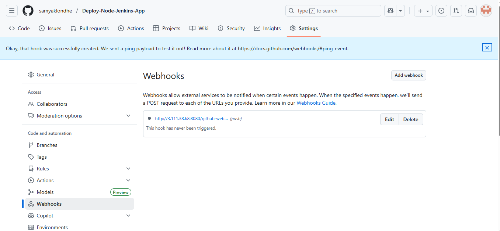

# 🚀 Node.js CI/CD Deployment using Jenkins Pipeline on AWS EC2

## 🧩 Overview
This project demonstrates an automated CI/CD pipeline using Jenkins, GitHub, and AWS EC2 to deploy a Node.js application.
It covers full setup from instance creation to continuous deployment via GitHub Webhooks and PM2.

## 🖼️ Architecture Diagram
Insert your diagram showing:
Developer → GitHub → Jenkins (CI Server) → Node Server (CD) → Browser


## ☁️ Infrastructure Setup

### 1️⃣ Launch Two AWS EC2 Instances
- Instance 1: Jenkins Server
- Instance 2: Node.js Server
- Use a common security group allowing ports:
22 (SSH), 80 (HTTP), 3000 (App), 443 (HTTPS)

📸 Screenshot: AWS EC2 dashboard showing both instances running


### 2️⃣ Install Jenkins and Node.js on Jenkins Server
```bash
sudo apt update
sudo apt install fontconfig openjdk-21-jre -y
java -version
sudo wget -O /etc/apt/keyrings/jenkins-keyring.asc \
  https://pkg.jenkins.io/debian-stable/jenkins.io-2023.key
echo "deb [signed-by=/etc/apt/keyrings/jenkins-keyring.asc]" \
  https://pkg.jenkins.io/debian-stable binary/ | sudo tee \
  /etc/apt/sources.list.d/jenkins.list > /dev/null
sudo apt update
sudo apt install jenkins -y
sudo systemctl start jenkins
sudo systemctl enable jenkins

# Install Node.js
curl -fsSL https://deb.nodesource.com/setup_16.x | sudo -E bash -
sudo apt install -y nodejs

sudo cat /var/lib/jenkins/secrets/initialAdminPassword
(Copy Password and Paste in Jenkins Login Page)
```
📸 Screenshot: Jenkins running on port 8080 in browser


### 3️⃣ Install Node.js, npm, and PM2 on Node Server
```bash
sudo apt update
curl -fsSL https://deb.nodesource.com/setup_16.x | sudo -E bash -
sudo apt update
sudo apt install -y nodejs npm
sudo npm install -g pm2
```

### 4️⃣ Copy Private Key to Jenkins Server
From local:
```bash
scp -i <Jenkins.pem> <Deploy.pem> ubuntu@<jenkins-server-ip>:/home/ubuntu/
```
Then:
```bash
chmod 400 <key.pem>
```
📸 Screenshot: SCP command execution


### 5️⃣ Install Jenkins Plugins
Inside Jenkins:
Go to Manage Jenkins → Manage Plugins → Available
Install:
- Pipeline
- SSH Agent
- GitHub

📸 Screenshot: Installed plugins list


### 6️⃣ Create Jenkinsfile (Without Pushing To Github)
Create Jenkinsfile in your Node.js app directory:

### 7️⃣ Add SSH Key Credentials in Jenkins
Go to Manage Jenkins → Credentials → Global → Add Credentials
Kind: SSH Username with private key
ID: deploy-key
Username: ubuntu
Paste private key content

📸 Screenshot: Jenkins credentials screen with deploy-key added


### 8️⃣ Set Up GitHub Webhook
In GitHub repository:
Go to Settings → Webhooks → Add Webhook

Payload URL:
http://jenkins-public-ip:8080/github-webhook/
Content type: application/json
Select: Just the push event

📸 Screenshot: GitHub webhook settings page


### 9️⃣ Create Jenkins Job
Create new item → Pipeline
Under Build Triggers, select:
- GitHub hook trigger for GITScm polling
Under Pipeline Script from SCM:
- SCM: Git
- Repository URL: https://github.com/<your-username>/<repo>.git
- Branch: main
- Script Path: jenkinsfile


### 🔟 Push Files to Repository
```bash
git add .
git commit -m "Added Jenkins pipeline for Node deployment"
git push origin main
```

This automatically triggers the Jenkins pipeline via webhook.


### ✅ Verify Deployment
After pipeline success, open:
http://{node-server-public-ip}:3000
📸 Screenshot: Node.js app running in browser


## 🧩 Tools & Technologies
- AWS EC2
- Jenkins
- GitHub Webhooks
- Node.js / npm
- PM2
- SSH Agent Plugin

## 🧠 Key Learning
- End-to-end CI/CD pipeline setup on AWS
- Secure SSH deployment
- Webhook-based automated builds
- Jenkins Pipeline scripting

## 👨‍💻 Author
Samyak Londhe  
🎓 MCA Student | 💼 Aspiring DevOps & Cloud Enthusiast    
🌐 https://github.com/samyaklondhe